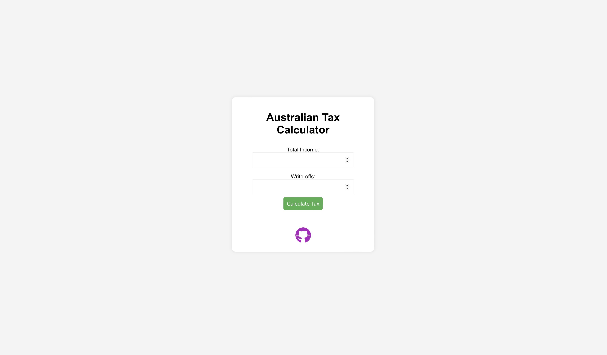

# Australian Tax Calculator FY 24 - 25


A React-based web application to calculate and compare Australian individual income tax liabilities for the financial years 2023-24 and 2024-25, considering the recent changes in tax rates and thresholds.

## Table of Contents

- [Introduction](#introduction)
- [Features](#features)
- [Installation](#installation)
- [Usage](#usage)
- [Deployment](#deployment)
- [Contributing](#contributing)
- [License](#license)
- [Contact](#contact)
- [Screenshots](#screenshots)

## Introduction

This web application allows users to input their total income and write-offs to estimate their annual tax liability. It provides a detailed breakdown of tax calculations for both the 2023-24 and 2024-25 financial years, considering the new tax rates and thresholds introduced by the Australian government.

## Features

- Input fields for total income and write-offs.
- Calculation of tax liabilities for the financial years 2023-24 and 2024-25.
- Detailed breakdown of tax calculations for each threshold.
- Responsive and user-friendly interface.
- Hosted on GitHub Pages.

## Installation

To run this project locally, follow these steps:

1. **Clone the repository**:
    ```sh
    git clone https://github.com/yourusername/australian-tax-calculator.git
    cd australian-tax-calculator
    ```

2. **Install dependencies**:
    ```sh
    npm install
    ```

## Usage

To start the development server, run:
```sh
npm start
```

This will open the app in your default web browser at http://localhost:3000.

## Deployment

This project is deployed using GitHub Pages. To deploy the app, follow these steps:

Install the gh-pages package:

```sh
npm install gh-pages --save-dev
```
Update package.json:

```
"homepage": "https://yourusername.github.io/australian-tax-calculator",
```
```
"scripts": {
  "predeploy": "npm run build",
  "deploy": "gh-pages -d build"
}
```
Deploy the app:

```sh
npm run deploy
```

## Contributing

Contributions are welcome! Please open an issue or submit a pull request for any improvements or bug fixes.

## License

This project is licensed under the MIT License - see the LICENSE file for details.

## Contact

Email: <a href="mailto:sharmahemang2000@gmail.com">sharmahemang2000@gmail.com</a><br>
LinkedIn: <a href="https://www.linkedin.com/in/sharmahemang">sharmahemang</a><br>
GitHub: <a href="https://github.com/hemangsharma">hemangsharma</a><br>
Personal Website: <a href="https://www.sharmahemang.com">www.sharmahemang.com</a><br>

## Screenshots



## Disclaimer

This tool provides stylized representations based on the taxable income of an individual. The total amount calculated is your annual tax cut. Depending on your individual circumstances, your tax cut may not be received as a lump sum. For most taxpayers, it will be reflected incrementally each payday. The estimates in this tool are based on comparing 2023-24 tax rates and thresholds with 2024-25 tax rates and thresholds. The reduction in tax liability is calculated by only taking into account the basic tax scales, low-income tax offset (as applicable), and the Medicare levy for the respective income year. This tool is for illustrative purposes only. It does not consider individual circumstances which may result in an actual tax outcome that is different from what is presented above. The tool is not intended to provide taxation or financial advice and should not be relied on as an accurate assessment of your individual tax affairs. Taxpayers should seek independent, expert advice on their taxation affairs (as appropriate).
